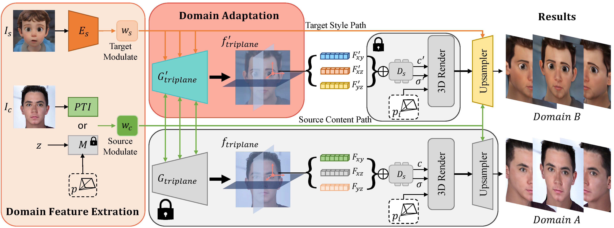
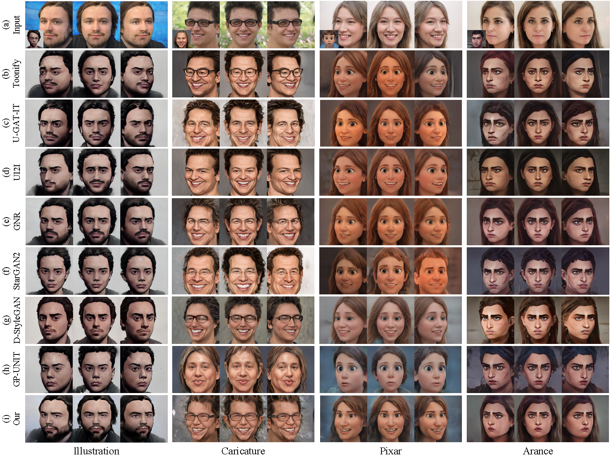

# PStyle-3D - Official PyTorch Implementation



This repository provides the discription for the following paper:

**PStyle-3D: Example-based 3D-aware Portrait Style Domain Adaptation**<br>
Chaohua Shi, [Mingrui Zhu](https://scholar.google.com/citations?user=a8FXS1UAAAAJ&hl=zh-CN&oi=ao), [Nannan Wang](https://scholar.google.com/citations?hl=zh-CN&user=SRBn7oUAAAAJ) and [Xinbo Gao](https://scholar.google.com/citations?user=VZVTOOIAAAAJ&hl=zh-CN&oi=ao)<br>
<br>
> **Abstract:** *The creation of high-quality artistic portraits is a critical and desirable task in the field of computer vision. While recent 3D generative models have achieved impressive results in generating images with view consistency and intricate 3D shapes, their application for generating artistic portraits is often more challenging than 2D generative models due to the potentially destructive impact of 3D structures on human faces. This paper introduces a novel approach that leverages a meticulously designed domain feature extraction module to extract the specific feature information from both the original natural face domain and the target artistic portrait domain. These extracted features are seamlessly integrated into a 3D representation, generating multi-view consistent 3D artistic portraits. To fuse the features of the source and target domains better, we propose a new module for domain style modulation. This module adds a path to the style path established by StyleGAN to introduce the artistic portrait domain information and regulate the target domain's feature information in $\mathcal{S}$ space. Our Domain Adaptation Module is implemented in each StyleBlock of the 3D representation generator to integrate the target domain information with the original facial information. Experimental results demonstrate that our approach generates high-quality 3D artistic portraits that outperform existing approaches in preserving 3D geometric information and multi-view consistency.*



**Dependencies:**

We have tested on:
- CUDA 11.3
- PyTorch 1.11.0
- 64-bit Python 3.8

All dependencies for defining the environment are provided in `environment/pstyle_3D_env.yaml`.
We recommend running this repository using [Anaconda](https://docs.anaconda.com/anaconda/install/):
```bash
conda env create -f ./environment/pstyle_3D_env.yaml
```

<br/>

## (1) Pretrained Models
Pretrained models for the four style domains can be downloaded from Google Drive:
- [Pixar](https://drive.google.com/drive/folders/1rDaA4f1q6FwPL1BRyGX_DNdVv0HufcWj?usp=drive_link)
- [Arance](https://drive.google.com/drive/folders/134TDQa0grxFcOoMTAzx_VJ57DEY011mM?usp=drive_link)
- [Caricature](https://drive.google.com/drive/folders/1koBgcFevlk4Yj0DvXbb82kTkZjldSII7?usp=drive_link)
- [Illustration](https://drive.google.com/drive/folders/1zP2WqyUMBTwWXZlUwTqejHoBBZ_a8Oag?usp=drive_link)

## (2) Datasets
To accomplish the portrait style domain adaptation task, we use a natural face dataset as the source domain and some artistic portrait datasets as the target style domain.
- Natural face dataset: Flickr-Faces-HQ ([FFHQ](https://github.com/NVlabs/ffhq-dataset)). It containing 70,000 high-quality face images.
- Artistic portrait datasets: Pixar, Caricature, Arance, and Illustration. Each style dataset contains approximately 2,000 high-quality art portraits, crawled from art portrait production websites or generated using high-performance 2D generative models. [Dowanload](https://drive.google.com/drive/folders/134x55-4jC2dHH4Q5rBJN_T4zlB47HRBW?usp=drive_link)
- Data preprocessing: Our model data is processed in the same way as [EG3D](https://github.com/NVlabs/eg3d).

## (3) Resource consumption
- Training phase: For each target style domain, our model is trained on a single NVIDIA RTX 8000 GPU with 40GB of memory, requiring approximately 6 hours of training.
- Inference phase: Our model utilizes 16GB of GPU memory to generate a single-view artistic portrait. For the synthesis of continuous perspective artistic portrait videos, our model consumes 18GB of GPU memory, employing a frame-by-frame generation approach to synthesize the videos.
